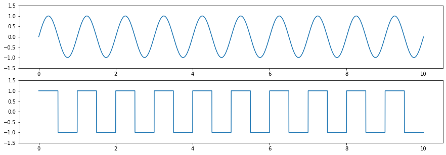
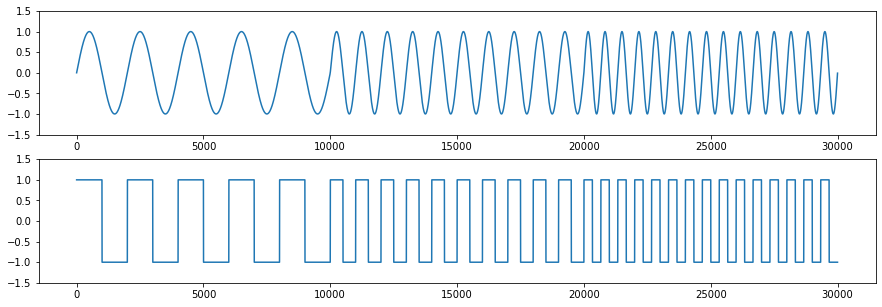
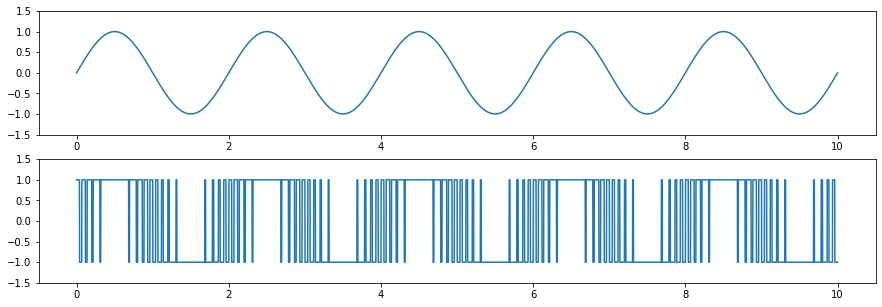
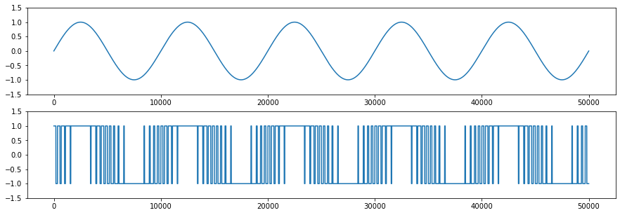

# Basic Data Generator

Just a very basic data generator for generating datasets for regression tasks. 

Datasets can be exported as `.csv` into `data` directory.

## Data
Three degrees of complexity: 

#### A square function based on a single sin function: 

---
#### A square function based on a sin fct with three different frequencies 

---

#### A pulse-width modulated function based on sin function: 

The sin function for the pwm is the same for pulse width and square fct. There is a modulation parameter `a`.

---

#### A pulse-width modulated function based on sin and tan function: 

A pwm function is based on sin and tan functions. There are modulation parameters `a` and `b`.

---
## LICENSE
Licensed under the Apache License, Version 2.0 (the "License"); you may not use it except in compliance with the License. A copy of the License is included in the project, see the file LICENSE.
