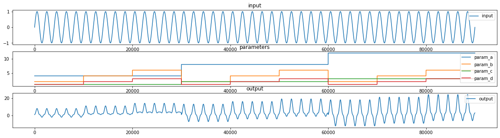
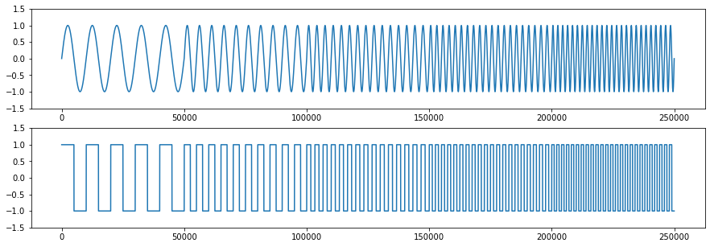

# Basic Data Generator

Just a basic and very basic data generator for generating datasets for regression tasks. 
The dataset describe the transformation of an input `x` using simple transformation functions with parameters `param_[x]`
into an output `y`.

Datasets can be exported as `.csv` into `data` directory.

Dependencies for creating own derivatives of the datasets and to run the notebook are saved in `bgd.yml`

## Very Basic Datagenerator
There are three different datasests with three degrees of complexity. 

### Transforming a sin function with a first order polynom: 

.sin fct with polynomial transformation of first degree
param: a and b 

- network input: sin + a param + b param 
- network output: transformed sin

Three functions with different parameter permutations are saved as `ds1o.csv`.

---

### Transforming a sin function with a second order polynom: 

sin fct with polynomial transformation of second degree
param: a, b, c 

- network input: sin + a param + b param + c param
- network output: transformed sin

Three functions with different parameter permutations are saved as `ds2o.csv`.

---

### Transforming a sin function with a third order polynom: 

sin fct with polynomial transformation of third degree
param: a, b, c, d 

- network input: sin + a param + b param + c param + d param
- network output: transformed sin

Three functions with different parameter permutations are saved as `ds3o.csv`.

## Basic Datagenerator
There are three different datasests with three degrees of complexity. 

### A square function based on a single sin function with five frequencies: 

A square function based on a simple sinus function is derived and sampled for 50.000 steps.

Five of the square functions with varying frequencies are appended to the dataset `sin_squ.csv`.

---

### A pulse-width modulated square function based on sin function: 

A pulse width modulated square function based on a simple sinus function is derived and sampled for 50.000 steps.
The parameter `a` influences the modulation.

Five different frequencies are appended into the dataset `sin_pwm.csv`.

---

### A pulse-width modulated function based on sin and tan function: 

A pulse width modulated square function based on a simple sinus and tangens function is derived and sampled for 50.000 steps.
The parameters `a` and `b` influence the modulation.

Five different frequencies are appended into the dataset `sin_tan_pwm.csv`.

---
## LICENSE
Licensed under the Apache License, Version 2.0 (the "License"); you may not use it except in compliance with the License. A copy of the License is included in the project, see the file LICENSE.
